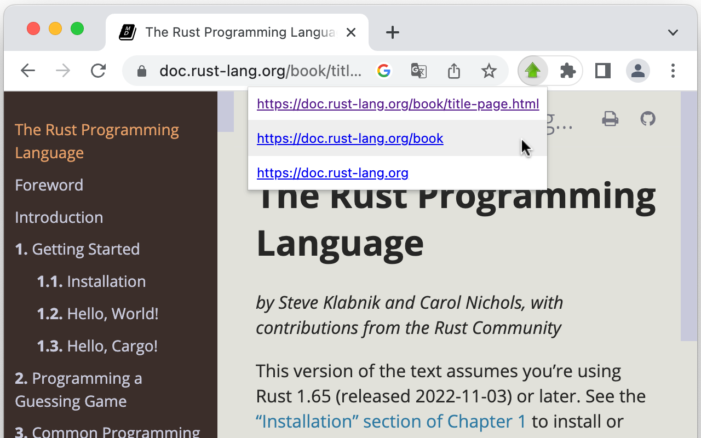
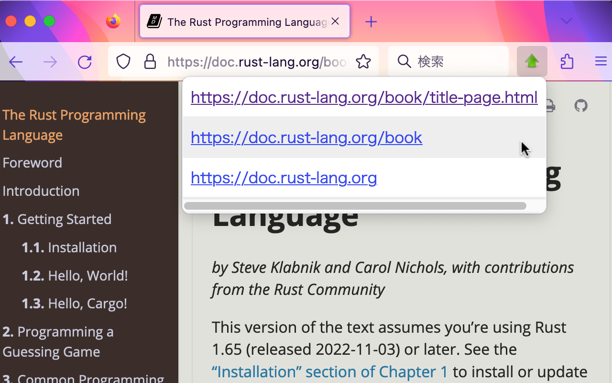
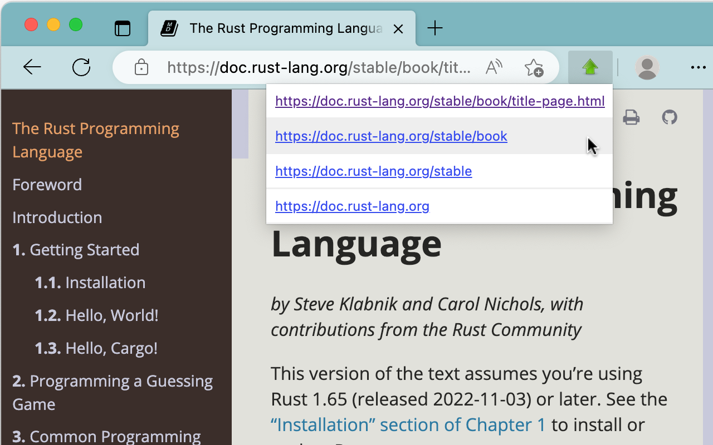

# 🚀 Go Up Key

**Go Up Key** is a browser extension that allows you to quickly jump to the parent directory of the current URL using a keyboard shortcut.

This extension offers a similar functionality to the “Go Up” extension by enabling users to navigate to the parent directory directly, but it does so through keyboard shortcuts instead of a popup interface, providing a more streamlined and efficient way to navigate. You can also use “Go Up” and “Go Up Key” simultaneously for even greater flexibility in navigation.

## Visual Representation

To help you understand how “Go Up Key” works, we’ve included screenshots from the “Go Up” extension. While “Go Up Key” operates solely through keyboard shortcuts and does not feature a popup interface, its functionality focuses on allowing quick access to parent directories.

## How to Install

You can install the extension from your browser’s extension store:

- [Chrome / Brave](https://chromewebstore.google.com/)
- [Firefox](https://addons.mozilla.org/en-US/firefox/)
- [Edge](https://microsoftedge.microsoft.com/addons/Microsoft-Edge-Extensions-Home)

## Keyboard Shortcuts

| Action          | Windows / Linux  | Mac               |
|-----------------|------------------|-------------------|
| **Go Up**       | Alt + Up         | Command + Up       |

## Usage

While viewing any page, simply press the keyboard shortcut **Alt + Up** (or **Command + Up** on Mac) to navigate to the parent directory of the current URL.

This feature is particularly useful when browsing documentation or file directories where you want to quickly return to the previous level. You can use “Go Up” to view links to upper directories, while “Go Up Key” allows for keyboard navigation, providing a seamless experience.
