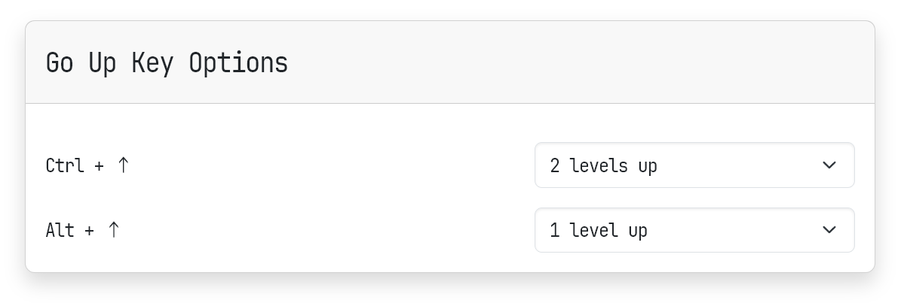

# 🚀 Go Up Key

**Go Up Key** is a browser extension that allows you to quickly navigate to the parent directory of the current URL using keyboard shortcuts.

This extension provides a streamlined and efficient way to move up in a website's hierarchy without relying on the site's navigation links.

## How to Install

You can install the extension from your browser’s extension store:

- Chrome / Brave: *Coming Soon*
- Firefox: *Coming Soon*
- Edge: *Coming Soon*

## Keyboard Shortcuts

| Action               | Windows / Linux           | Mac                       |
|----------------------|---------------------------|---------------------------|
| **Go Up (Configurable)** | Ctrl + Up Arrow or Alt + Up Arrow | Command(⌘) + Up Arrow or Option(⌥) + Up Arrow |

## Usage

While viewing any page, you can navigate to the parent directory of the current URL by pressing one of the keyboard shortcuts:

- **Ctrl + Up Arrow** (Windows/Linux) or **Command(⌘) + Up Arrow** (Mac)
- **Alt + Up Arrow** (Windows/Linux) or **Option(⌥) + Up Arrow** (Mac)

By default, these shortcuts will move you up one level in the URL path. You can configure the number of levels to move up or disable specific shortcuts in the extension's options page.

## Options

To customize the extension's behavior:

1. Right-click the extension icon and select **Options**.
2. Choose how many levels you want each keyboard shortcut to navigate up (1 or 2 levels).
3. You can also disable a shortcut if you don't want to use it.

---

This feature is particularly useful when browsing documentation or file directories where you want to quickly return to a higher level without manually editing the URL or searching for navigation links.

Feel free to use “Go Up Key” alongside other navigation extensions for an even greater flexibility in browsing.
