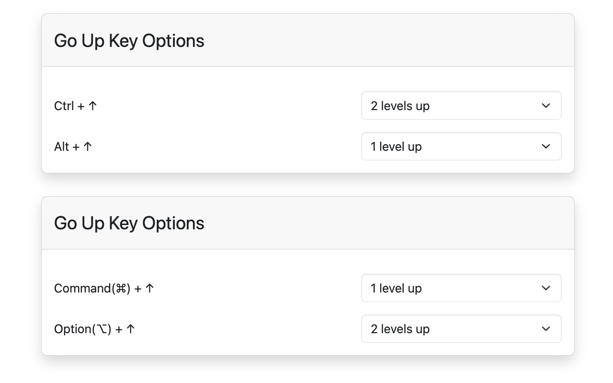

# 🚀 Go Up Key

**Go Up Key**は、キーボードショートカットを使用して現在のURLの親ディレクトリに素早く移動できるブラウザ拡張機能です。

この拡張機能は、サイトのナビゲーションリンクに頼らずにウェブサイトの階層を移動するための効率的な方法を提供します。

## インストール方法

ブラウザの拡張機能ストアからインストールできます：

- [Chrome / Brave](https://chromewebstore.google.com/detail/go-up-key/fdhnikbmoepilpndfpakljadlinfnnkj)
- [Firefox](https://addons.mozilla.org/ja/firefox/addon/go-up-key/)
- [Edge](https://microsoftedge.microsoft.com/addons/detail/go-up-key/kfkeepcbmfonnhdajjoineblcaddamkd)
## キーボードショートカット

### Windows

| アクション               | ショートカット        |
|--------------------------|-----------------------|
| **上へ移動（設定可能）** | Ctrl + ↑              |
| **上へ移動（設定可能）** | Alt + ↑               |

### Mac

| アクション               | ショートカット            |
|--------------------------|---------------------------|
| **上へ移動（設定可能）** | Command(⌘) + ↑          |
| **上へ移動（設定可能）** | Option(⌥) + ↑           |

**メモ**: 一部のMacブラウザでは、`Command(⌘) + ↑`が動作しない場合があります。その場合は別のショートカットをご利用ください。

## 使用方法

ウェブページを閲覧中に、プラットフォームに対応したキーボードショートカットを押すことで、現在のURLの親ディレクトリに移動できます。

デフォルトでは、これらのショートカットはURLパス内で1階層上に移動します。拡張機能のオプションページで、移動する階層数を変更したり、特定のショートカットを無効にしたりできます。

## オプション

拡張機能の動作をカスタマイズするには：

1. 拡張機能管理画面から **Go Up Key** を選択して、**オプション** を選択します。
2. 各キーボードショートカットで移動する階層数（1つ上または2つ上）を選択します。
3. 使用しないショートカットを無効にすることもできます。

---

この機能は、ドキュメントやファイルディレクトリを閲覧しているときに、URLを手動で編集したりナビゲーションリンクを探したりすることなく、素早く上位のレベルに戻りたい場合に特に便利です。

“Go Up Key”を他のナビゲーション拡張機能と組み合わせて使用することで、さらに柔軟なブラウジングが可能になります。

## 関連する拡張機能

- [Go Up](https://github.com/tomarint/go-up)
